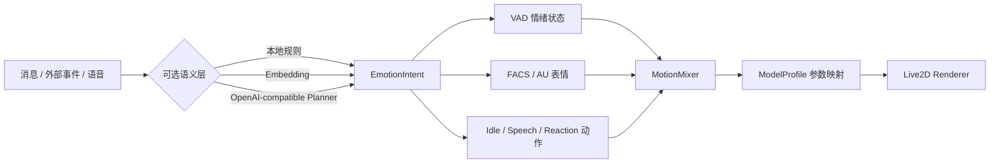

<div align="center">

# Soullink Emotion SDK

### 为各类桌宠接入自然连贯的 Live2D 表情与动作

将消息、外部事件和语音状态，转换成连续情绪、FACS/AU 表情、身体动作、口型与模型参数。

<p>
  <a href="https://github.com/nanlingyin/soullink-emotion-sdk/stargazers"></a>
  <a href="https://github.com/nanlingyin/soullink-emotion-sdk/actions/workflows/verify.yml"></a>
  <a href="https://github.com/nanlingyin/soullink-emotion-sdk/blob/main/LICENSE"></a>
  <a href="https://www.npmjs.com/package/@soullink-emotion/sdk"></a>
</p>

<p>
  <a href="#效果展示">查看效果</a> ·
  <a href="#快速开始">快速开始</a> ·
  <a href="./packages/README.md">完整接入指南</a> ·
  <a href="https://github.com/nanlingyin/soullink-emotion-sdk/issues">反馈问题</a>
</p>

</div>

<p align="center">
  <a href="https://www.bilibili.com/video/av116943369543262/">
    
  </a>
</p>

<p align="center">
  <a href="./docs/assets/soullink-emotion-demo.mp4">下载或播放仓库内演示视频</a> ·
  <a href="https://www.bilibili.com/video/av116943369543262/">在 Bilibili 查看原视频</a>
</p>

## 项目简介

Soullink Emotion SDK 是一套面向 Live2D 数字角色、桌宠和 AI 角色的实时表演引擎。它不把角色表现简化成“收到一句话，切换一个表情”，而是维护一条连续的情绪与动作状态：情绪有强度，动作有时序，语音有口型，模型有自己的参数能力。

你可以只使用无网络的 TypeScript engine，也可以按需组合 Planner、Embedding、TTS、PIXI 渲染器、Vue 校准工具和 HTTP API。

## 效果展示

演示视频完整展示了从消息理解到 Live2D 表演的链路：

| 时间段 | 展示内容 |
| --- | --- |
| 00:00 | Live2D 表情与动作控制的整体目标 |
| 00:45 | Embedding 情绪分类与消息驱动 |
| 01:55 | VAD + FACS 生成当前情绪参数 |
| 03:40 | 语音、口型与连续动作协同 |
| 04:30 | Soullink Emotion 整体效果回顾 |

> 视频文件来自本项目演示素材，模型和 Cubism Core 的授权请以各自发布方条款为准。

## 核心能力

| 能力 | 说明 |
| --- | --- |
| 连续情绪 | 使用 Valence、Arousal、Dominance 三个轴表达情绪方向与强度 |
| FACS / AU | 通过模型无关的表情语义描述微笑、皱眉、注视和姿态 |
| 连贯动作 | Idle、VAD 手势、反应动作和语音表现使用独立层混合 |
| 语音口型 | 支持 RMS / peak 音量、attack / release 平滑和安全的嘴部 ownership |
| Profile 适配 | 自动扫描模型参数，生成 `soullink.profile.json` 和能力覆盖率 |
| 原生动画 | 复用模型已有的 expression / motion，并与程序化参数协同 |
| 可复现调试 | 通过 `seed` 固定随机序列，复现同一段动作表现 |
| 渐进式接入 | 不绑定 LLM、Embedding、TTS、UI 框架或后端服务 |

## 工作流



## 为什么适合桌宠

桌宠需要的不是一次性动画，而是持续、可打断、能适配不同模型的表现状态。Soullink Emotion 将表现拆成可组合的层：

- 情绪层决定角色当前的整体状态和自然回落。
- Idle 层提供呼吸、眨眼、注视、微动和低频姿态变化。
- Reaction 层承接消息带来的即时表情与动作。
- Speech Performance 层为说话生成头部、身体、视线和表情重音，但不抢占 LipSync 的嘴部控制权。
- ModelProfile 层把语义通道映射成具体模型的 Cubism 参数，并按模型能力自动降级。

## 包一览

| 包 | 用途 | 环境 |
| --- | --- | --- |
| `@soullink-emotion/sdk` | 一次安装完整 SDK 的 meta package | Browser / Node |
| `@soullink-emotion/engine` | VAD、FACS/AU、Idle、反应时序、口型与参数混合 | Browser / Node |
| `@soullink-emotion/runtime-core` | 消息、Planner、TTS、Audio、Clock 和 engine 编排 | Browser / Node |
| `@soullink-emotion/planner-openai` | OpenAI-compatible 反应、反思、主动消息与说话动作规划 | Browser / Node |
| `@soullink-emotion/classifier-embedding` | Embedding 情绪分类、中文语料、缓存和规则降级 | Browser / Node |
| `@soullink-emotion/profile-generator` | 扫描模型文件并生成 Profile | Node |
| `@soullink-emotion/live2d-pixi` | PIXI v7 Live2D 渲染和模型元数据读取 | Browser |
| `@soullink-emotion/devtools-vue` | Profile 覆盖率、参数预览和 Vue 校准面板 | Browser / Vue 3 |
| `@soullink-emotion/api-client` | HTTP API 客户端和 runtime adapters | Browser / Node |

## 快速开始

### 安装完整 SDK

```bash
npm install @soullink-emotion/sdk
```

### 只使用纯 TypeScript engine

```bash
npm install @soullink-emotion/engine
```

```ts
import {
  SoullinkRuntime,
  loadModelProfile,
  motionStylePresets
} from "@soullink-emotion/engine";

const { profile } = await loadModelProfile("/models/hiyori/soullink.profile.json");
const runtime = new SoullinkRuntime({
  profile,
  motionStyle: {
    ...motionStylePresets.natural,
    seed: 20260717
  }
});

runtime.sendMessage("今天辛苦了", 0);
const snapshot = runtime.update(timeSeconds, deltaSeconds);
renderer.setParameters(snapshot.live2dParams);
```

### 为语音加入连贯动作

```ts
import {
  SpeechPerformancePlanner,
  SoullinkRuntime,
  deriveSpeechPerformanceCapabilities
} from "@soullink-emotion/engine";

const planner = new SpeechPerformancePlanner();
const performance = planner.plan({
  emotion: "happy",
  durationMs: 4200,
  intensity: 0.75,
  confidence: 0.9,
  capabilities: deriveSpeechPerformanceCapabilities(profile),
  lifecycleToken: requestId,
  seed: 20260717
});

runtime.startSpeechPerformance(performance, audioClockSeconds, "replace");
```

## 本地实验室

仓库包含一个可以直接运行的浏览器测试台，支持模型加载、情绪预设、VAD 控制、FACS 覆盖、动作风格、语音动作规划和参数调试。

```bash
npm install
npm run dev
```

打开 `http://127.0.0.1:4173`。不配置 AI 服务也可以使用本地规则、情绪预设、VAD、FACS 和 Idle 动作；Embedding、Planner 和 TTS 模式需要额外配置服务。

发布前完整校验：

```bash
npm run release:check
```

环境要求：Node.js 20.19+ 或 Node.js 22.12+，npm 10+。

## Star 趋势

感谢每一位关注、试用和反馈的开发者。Star 数会随 GitHub 实时更新，历史趋势如下：

<p align="center">
  <a href="https://star-history.com/#nanlingyin/soullink-emotion-sdk&Date">
    
  </a>
</p>

## 文档导航

- [完整包接入指南](./packages/README.md)
- [测试与发布说明](./TESTING.md)
- [发布流程](./RELEASING.md)

## 安全与资产说明

- Provider 凭据只能放在可信的服务端环境，不能写入 `src`、`VITE_*`、Profile 或发布包。
- Live2D 模型、贴图和 Cubism Core 不属于本 SDK 的 MIT 授权范围，分享模型前请单独确认授权条款。
- 仓库中的演示视频仅用于说明 SDK 的表现效果；其中出现的角色模型、音乐和素材仍以原作者授权为准。

## License

Soullink Emotion SDK 以 MIT License 发布，详见 [LICENSE](./LICENSE)。

<div align="center">

如果这个项目对你的桌宠、虚拟角色或 Live2D 应用有帮助，欢迎在 GitHub 点一个 Star。

</div>
